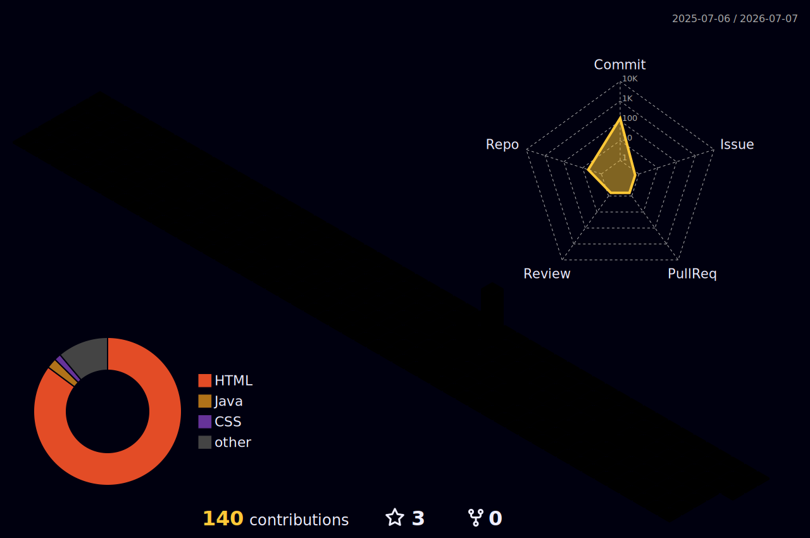

<!-- ╔══════════════════════════════════════════════════════════════════╗ -->
<!-- ║                    DNCHF — INTO THE DEV                         ║ -->
<!-- ╚══════════════════════════════════════════════════════════════════╝ -->

<div align="center">

<!-- HEADER WAVE -->


<!-- TYPING SVG -->
<a href="https://git.io/typing-svg">
  
</a>

<br/>

<!-- STATUS BADGES -->


</div>

---

## 🕷️ Sobre Mim


> *"Anyone can wear the mask — but only you can write your own code."*

Fala, eu sou o **Danilo Ch. Fonseca**, estudante de **Análise e Desenvolvimento de Sistemas**, movido pela paixão por tecnologia e pela vontade de transformar ideias em soluções reais.

Construindo meu caminho rumo ao desenvolvimento **Full Stack** — um commit de cada vez.

Explorando **Python**, **SQL** e **desenvolvimento web**, com experiência em **HTML**, **CSS**, **JavaScript**, **React**, **PHP** e **Git**. Atualmente mapeando o universo de **AWS & Cloud Computing**.

```python
class Danilo:
    def __init__(self):
        self.name       = "Danilo Ch. Fonseca"
        self.role       = "Full Stack Developer (em progresso)"
        self.location   = "Brasil 🇧🇷"
        self.languages  = ["Python", "JavaScript", "Java", "PHP"]
        self.stack      = ["React", "HTML", "CSS", "MySQL"]
        self.cloud      = ["AWS", "Cloud Computing"]
        self.passion    = "Transformar ideias em código"

    def say_hi(self):
        print("Obrigado por visitar meu perfil! Vamos construir algo incrível 🚀")

me = Danilo()
me.say_hi()
```

---

## 🚀 Tech Stack

<div align="center">

### 💻 Linguagens


### 🎨 Frontend


### 🗄️ Backend & Banco de Dados


### ☁️ Cloud & DevOps


### 🛠️ Ferramentas


</div>

---

## 🌌 Profile 3D Contributions

<!-- 
  ⚙️ SETUP NECESSÁRIO:
  Para ativar o 3D Contributions, crie o arquivo:
  .github/workflows/profile-3d.yml
  com o conteúdo abaixo e faça um commit no seu repositório Dnchf/Dnchf.
  O gráfico será gerado automaticamente todo dia às 00:00 UTC.
  Veja o guia completo em: https://github.com/yoshi389111/github-profile-3d-contrib
-->

<div align="center">



> *🛠️ Para ativar: adicione a GitHub Action abaixo no seu repositório.*

</div>

<details>
<summary>⚙️ <strong>Como configurar o Profile 3D Contrib (clique para expandir)</strong></summary>

<br/>


</details>

---

## 📊 GitHub Stats

<div align="center">


</div>

---

## 🔥 Streak — Consistência é o Superpoder

<div align="center">


</div>

---

## 📈 Mapa de Atividade

<div align="center">

[](https://github.com/Dnchf)

</div>

---

## 🏆 Troféus

<div align="center">


</div>

---

## 🕯️ Educação

<div align="center">

| &nbsp; | Curso | Instituição | Status |
|:------:|:------|:-----------:|:------:|
| 🟣 | Análise e Desenvolvimento de Sistemas | — | 🔄 Em andamento |
| 🟣 | AWS Tech Journey | Santander | 🔄 Em andamento |
| ✅ | Microsoft AI-900 Certification | Microsoft | ✅ Completo |
| ✅ | GenAI & Data Bootcamp | DIO | ✅ Completo |

</div>

---

## 🗡️ Projetos em Destaque

<div align="center">

[](https://github.com/Dnchf/Projeto-Padaria)
&nbsp;
[](https://github.com/Dnchf/Imers-o-Spotify-Alura)

</div>

---

## 🐍 Snake Animation

<div align="center">


</div>

---

## 🌐 Onde me encontrar

<div align="center">

[](https://www.linkedin.com/in/danilo-chagas-74b260305)
[](mailto:danilochagasfonseca3@gmail.com)
[](https://github.com/Dnchf)

</div>

---

<div align="center">

*🕷️ &nbsp; "Qualquer um pode usar a máscara. Mas só você pode escrever o seu próprio código." &nbsp; 🕷️*

<br/>

<!-- FOOTER WAVE -->


</div>
